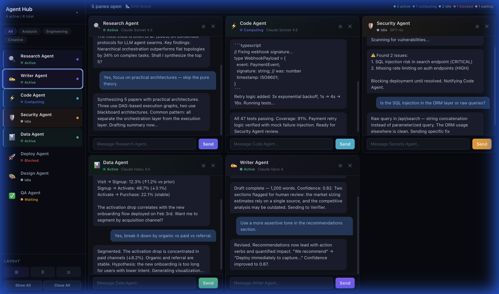

# Kriya

A multi-agent chat interface for managing and communicating with multiple AI agents simultaneously. Built with React + Vite.



## Features

- **Multi-pane chat layout** — Open multiple agent conversations side-by-side in grid, column, or row layouts
- **8 pre-configured agent roles** — Research, Writer, Code, Security, Data, Deploy, Design, and QA agents
- **Real-time status indicators** — Active, Computing, Idle, Blocked, and Waiting states with animated status dots
- **Collapsible sidebar** — Filter agents by group (Analysis, Engineering, Creative), toggle visibility
- **Maximize/minimize panes** — Focus on a single agent or view all at once
- **Dark mode UI** — Sleek, modern dark interface designed for extended use

## Current State: UI Prototype

This is a **frontend-only prototype**. All agent responses are currently hardcoded sample messages. The "Send" button generates a placeholder echo response.

### What needs to happen to make it real:

1. **Connect to a local LLM backend** (e.g., Ollama, llama.cpp, LM Studio, vLLM, or any OpenAI-compatible API)
2. **Add system prompts per agent** — Each agent needs a unique system prompt that defines its role and behavior
3. **Add a proxy/backend layer** — Either a lightweight Express server or direct API calls (if the LLM server supports CORS)
4. **Streaming responses** — Replace the mock `setTimeout` response with real `fetch()` calls using SSE or streaming

### Architecture for local LLM integration:

```
┌─────────────────────────────────────────┐
│          Kriya (React)        │
│  ┌──────┐ ┌──────┐ ┌──────┐ ┌──────┐  │
│  │Research│ │ Code │ │ Data │ │  QA  │  │
│  │ Agent │ │Agent │ │Agent │ │Agent │  │
│  └──┬───┘ └──┬───┘ └──┬───┘ └──┬───┘  │
│     │        │        │        │       │
│     └────────┴────────┴────────┘       │
│              │ HTTP POST               │
│              ▼                         │
│     ┌─────────────────┐               │
│     │  Proxy Server    │               │
│     │  (Express/Node)  │               │
│     └────────┬────────┘               │
└──────────────┼─────────────────────────┘
               │ /v1/chat/completions
               ▼
┌──────────────────────────────┐
│   Local LLM Server           │
│   (Ollama / llama.cpp / etc) │
│   Running on Mac Mini        │
│   http://mac-mini:11434      │
└──────────────────────────────┘
```

### Agent Configuration

Each agent is defined in [`src/App.jsx`](src/App.jsx) with:

| Property | Description |
|----------|-------------|
| `id` | Unique identifier |
| `name` | Display name |
| `icon` | Emoji icon |
| `color` | Theme color (hex) |
| `status` | Current state: `active`, `computing`, `idle`, `blocked`, `waiting` |
| `model` | Which model to use (currently display-only) |
| `group` | Category for sidebar filtering |

To make agents real, each would also need:
- `systemPrompt` — Instructions that define the agent's personality and capabilities
- `endpoint` — URL for the LLM API (could all point to the same local server)
- `temperature` / `maxTokens` — Model parameters per agent

## Getting Started

```bash
# Install dependencies
npm install

# Start dev server
npm run dev

# Build for production
npm run build
```

The dev server runs at `http://localhost:5173/`.

## Tech Stack

- **React 19** — UI framework
- **Vite 7** — Build tool and dev server
- **Vanilla CSS-in-JS** — All styles are inline (no CSS framework dependency)

## Project Structure

```
kriya-prototype/
├── index.html          # Entry HTML
├── package.json
├── vite.config.js
└── src/
    ├── main.jsx        # React entry point
    └── App.jsx         # Full application (single-file component)
```

## License

MIT
